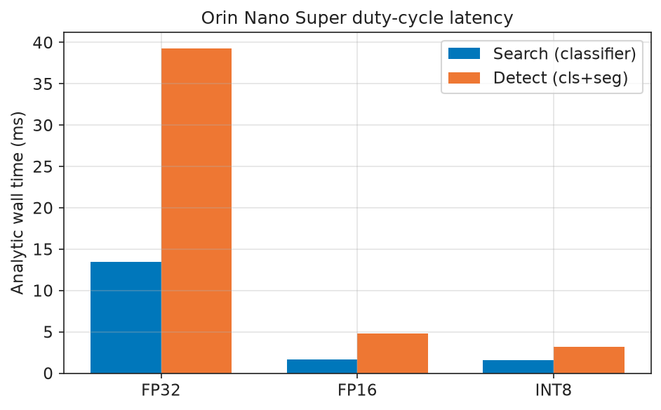
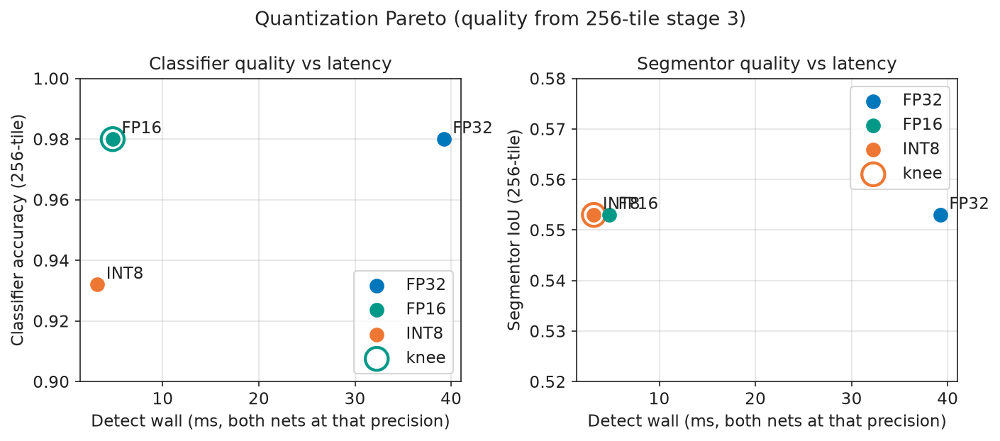
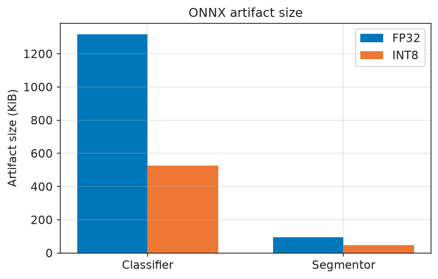
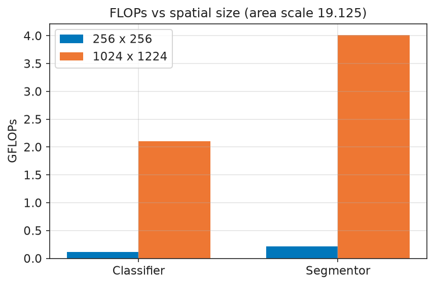
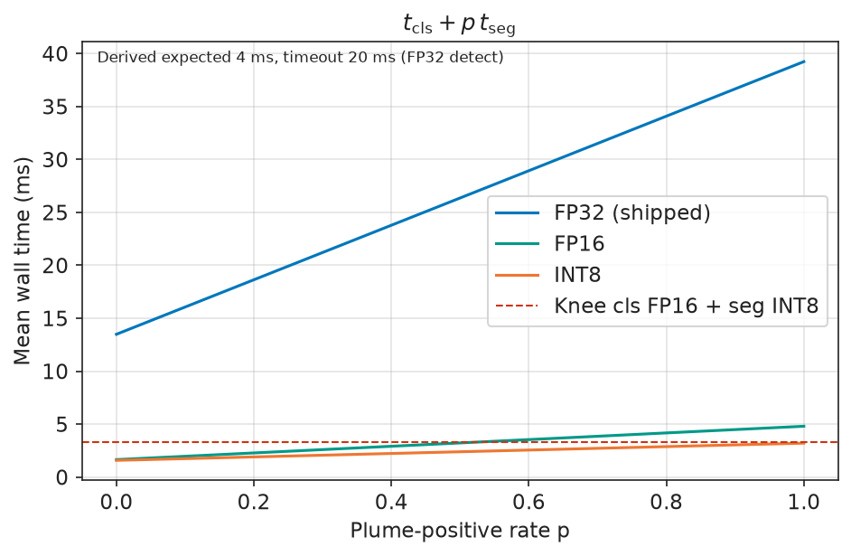
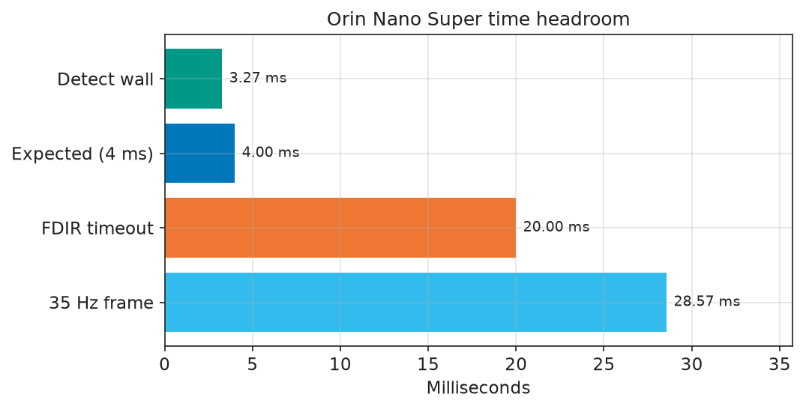
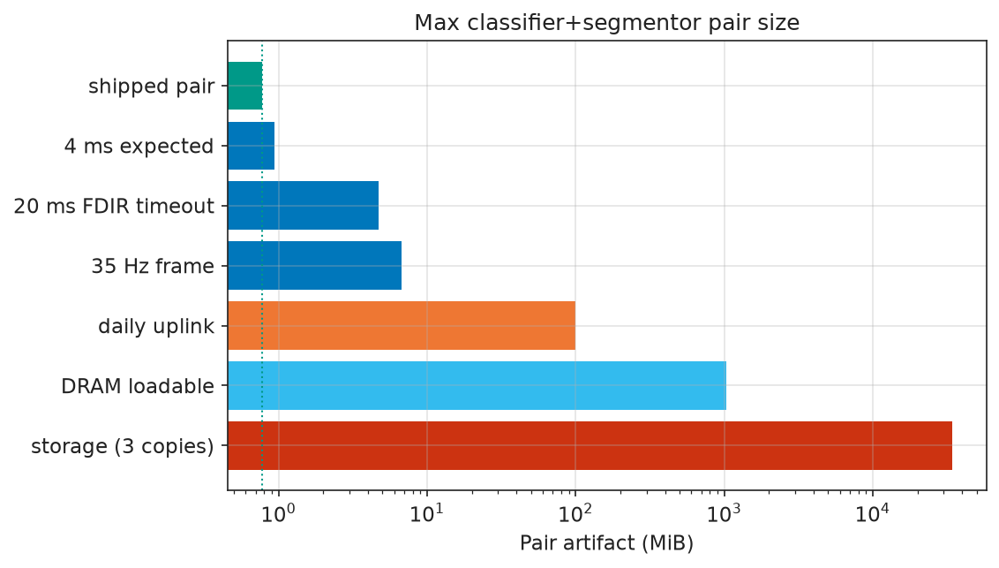
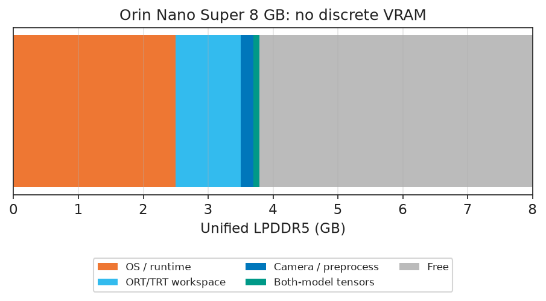
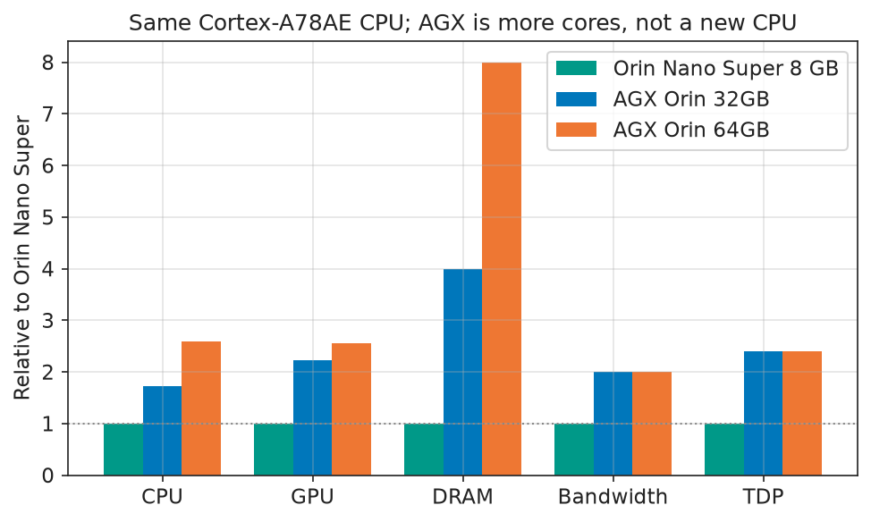

# Orin Nano Super full-frame inference

TEMPORARY ANALYSIS. Not flight software.

This study derives the flight expected-detect latency and the FDIR
inference timeout from Orin Nano Super peaks, model FLOPs, and a named
efficiency policy. It does not use placeholder millisecond targets.

## Headline

| Field | Value |
| --- | --- |
| Board | Jetson Orin Nano Super 8 GB |
| Shipped precision | mixed |
| Detect wall (analytic) | 3.27 ms |
| **Expected latency** | **4 ms** |
| **FDIR timeout** | **20 ms** |
| Timeout policy | `ceil(5 x expected)` |
| GPU busy at 35 Hz detect | 5.7% |
| **Both-model tensors** | **81.96 MiB** |
| Weights (cls FP16 + seg INT8) | 0.68 MiB |
| Tensors / 8 GB unified DRAM | 1.07% |
| **Usable pair at 20 ms** | **4.71 MiB** |
| Daily uplink cap | 100.00 MiB |

Write `expected_ms` into `inference.latency_budget_ms` and `timeout_ms`
into `fault.inference_timeout_ms`.

## Board lock

- Ampere 1024 CUDA / 32 tensor cores.
- CPU: 6-core Arm Cortex-A78AE v8.2 at 1.7 GHz. Unified LPDDR5, no VRAM.
- 17 FP16 TFLOPS, 2.08 FP32 TFLOPS (CUDA cores).
- 33 dense / 67 sparse INT8 TOPS.
- 8 GB LPDDR5 at 102 GB/s.
- Module Super TDP 25 W. Payload-bus FDIR stays 55 W.
- DLA present: False.
- Camera: BFS-U3-50S5 on USB3 (no CSI path in this repo).
- Power mode for a later Nano CSV: `MAXN SUPER` + `jetson_clocks`
  (True), JetPack 6.2+.
- Repo Python 3.14; JetPack system Python 3.10.
  This study does not change `requires-python`.

## Models

| | Classifier | Segmentor |
| --- | --- | --- |
| Arch | `shufflenetv2_x0_5_pt` | `dilatenet_w32` |
| Params | 343 k | 23.5 k |
| FLOPs @ 256x256 | 0.110 G | 0.21 G |
| FLOPs @ 1024x1224 | 2.104 G | 4.02 G |
| Area scale | 19.125 | 19.125 |
| 256-tile FP32 quality | acc 0.980 | IoU 0.553 |
| 256-tile INT8 quality | acc 0.932 | IoU 0.553 |
| Shipped ONNX | 0.73 MiB FP16 | 0.04 MiB INT8 |

Re-export at 1024x1224 is a contract fix. It does not create a full-frame
IoU number. Quality remains the 256-tile stage-3 measurement.

## Duty cycle

Classifier runs every frame. Segmentor runs only on a positive presence
decision. `t_search = t_cls`. `t_detect = t_cls + t_seg`.

| Precision | t_search (ms) | t_detect (ms) | cls kernel | seg kernel |
| --- | --- | --- | --- | --- |
| fp32 | 13.49 | 39.23 | 6.74 | 12.87 |
| fp16 | 1.65 | 4.80 | 0.83 | 1.57 |
| int8 | 1.58 | 3.20 | 0.79 | 0.81 |

## Latency model

- Compute bound: `GFLOP / peak_TFLOPS`.
- Memory bound: bytes / (102 GB/s).
- Kernel: `max(compute / 0.15, memory)`.
- Wall: `kernel / 0.5` (ORT + Python wrap).
- `expected_ms = ceil(t_detect)` for the shipped mixed knee.
- `timeout_ms = ceil(5 * expected_ms)`.

## Quantization knee

- Segmentor INT8 keeps 256-tile IoU. INT8 is the segmentor quality knee.
- Classifier INT8 drops accuracy 0.980 to 0.932. FP16 is the classifier
  working knee (same accuracy as FP32, Super tensor cores).
- Mixed knee detect wall (cls FP16 + seg INT8): 3.27 ms.
- Factory ONNX is that pair: classifier FP16, segmentor INT8 QDQ.
  Graph I/O stay float32. `use_int8` stays false because the configured
  paths already point at the quantized graphs, not FP32 siblings.

## Headroom

The 4 ms expected budget is ceil of the mixed-knee detect wall, so it
is tight by construction. Silicon and camera time are not.

| Against | Used | Remaining |
| --- | --- | --- |
| Expected 4 ms | 81.8% (3.27 ms) | 18.2% |
| FDIR timeout 20 ms | 16.4% | 83.6% |
| 35 Hz frame (28.57 ms) | 11.5% | 88.5% |
| GPU kernel at 35 Hz detect | 5.7% | 94.3% |

Weightless memory-floor wall is 1.57 ms per net.
That is 19.12 MiB float32 input plus 57.38 MiB stride-4 maps at 102 GB/s, then wrap.
The shipped kernels (1.64 ms together) sit on that floor.
Weights are 0.8 MiB against 76.50 MiB of I/O and maps.
DRAM reservation leaves 4.30 GB of 8 GB after 2.5 GB OS/runtime, 1 GB ORT/TRT workspace, and 0.2 GB camera buffers.
That split is a policy, not a Nano measurement.

## Unified memory (not VRAM)

Jetson Orin has no discrete VRAM. CPU, GPU, camera, and models share
8 GB of LPDDR5.

| Resident | Bytes |
| --- | --- |
| Classifier FP16 weights | 0.65 MiB |
| Segmentor INT8 weights | 0.02 MiB |
| Shipped ONNX pair | 0.77 MiB |
| Input (1, 4, 1024, 1224) float32 | 19.12 MiB |
| Live maps (stride 4, 64 ch) | 57.38 MiB |
| Segmentor mask out | 4.78 MiB |
| **Both nets, tensors** | **81.96 MiB** |
| Plus 1 GB workspace + TRT engines | 1037.17 MiB (13.6% of 8 GB) |

Weights are 0.68 MiB. Almost all of the inference footprint is the float32 band plane and feature maps, not parameters.
If latency is not the gate, the 100 MiB daily uplink binds before DRAM.
A wide full-res U-Net can grow skip maps toward ~1 GB and still fit.
ResNet-50 FP16 (~45 MiB) plus the shipped segmentor is a rounding error.

## Nano vs AGX

Every Orin SKU uses Arm Cortex-A78AE v8.2. AGX is more cores and a higher clock,
not a faster CPU microarchitecture.
Nano Super is 6 cores at 1.7 GHz.

| | CPU | GPU | DRAM | BW | TDP | TDP / 55 W bus | DLA |
| --- | --- | --- | --- | --- | --- | --- | --- |
| Jetson Orin Nano Super 8 GB | 6c x 1.7 GHz (1.00x) | 1024 CUDA (1.00x) | 8 GB (1.00x) | 102 GB/s (1.00x) | 25 W (1.00x) | 45% | 0 |
| Jetson AGX Orin 32GB | 8c x 2.2 GHz (1.73x) | 1792 CUDA (2.23x) | 32 GB (4.00x) | 204.8 GB/s (2.01x) | 60 W (2.40x) | 109% | 2 |
| Jetson AGX Orin 64GB | 12c x 2.2 GHz (2.59x) | 2048 CUDA (2.55x) | 64 GB (8.00x) | 204.8 GB/s (2.01x) | 60 W (2.40x) | 109% | 2 |

AGX 64GB is about 2.6x CPU throughput and 2.5x GPU CUDA-clock product.
It is 8x DRAM capacity and 2x bandwidth. It is not 10x compute.
AGX max TDP 60 W exceeds payload-bus FDIR 55 W.
Nano Super 25 W is 45% of that bus. The flight stack is Python apps
on six A78AE cores; extra cores do not change the model working set.
Orin NX 16GB Super is the SODIMM step if DRAM ever binds: 8 cores,
16 GB, 102 GB/s, 2x DLA, 25-40 W. AGX is the wrong lever for this pair.

## Max pair size

A classifier+segmentor pair upload is one bundle. Factory-family size
scales linearly with detect wall while weights stay small versus maps.
Catalog rows keep the shipped partner and swap one net.

Shipped pair on disk: 0.77 MiB.

| Ceiling | Max pair | Binds |
| --- | --- | --- |
| 4 ms expected | 0.94 MiB | latency |
| 20 ms FDIR timeout | 4.71 MiB | latency |
| 35 Hz frame | 6.73 MiB | latency |
| daily uplink | 100.00 MiB | uplink |
| DRAM loadable | 1025.20 MiB | dram |
| storage (3 copies) | 34133.33 MiB | storage |

Usable real-time ceiling is **4.71 MiB** (factory family grown 6.11x to the 20 ms timeout).
Raising expected/timeout is required past 4 ms.
Daily uplink is 100.00 MiB (419 s at 2 Mbps).
That cap is 21x the timeout-scaled factory pair.
A 100 MiB dense 1024x1224 convnet does not meet 20 ms.
Reassembly holds the blob in RAM with no other size cap.
CCSDS packets are 64 KiB, so large files are chunked.

Catalog drop-in (128-px stage-2 FLOPs times 76.5). Classifiers FP16,
segmentors INT8, other net stays the shipped factory graph.

| Arch | Kind | Params | FF GFLOP | Pair detect | 4 ms | 20 ms | 35 Hz |
| --- | --- | --- | --- | --- | --- | --- | --- |
| `shufflenetv2_x0_5_pt` | cls | 0.34 M | 2.29 | 3.42 ms | yes | yes | yes |
| `mobilenetv3_small_pt` | cls | 1.52 M | 3.06 | 4.02 ms | no | yes | yes |
| `mobilenetv3_large_pt` | cls | 4.20 M | 11.47 | 10.62 ms | no | yes | yes |
| `efficientnet_b0_pt` | cls | 4.01 M | 19.12 | 16.62 ms | no | yes | yes |
| `resnet18_pt` | cls | 11.18 M | 92.56 | 74.22 ms | no | no | no |
| `resnet50_pt` | cls | 23.51 M | 205.78 | 163.02 ms | no | no | no |
| `dilatenet_w32` | seg | 0.02 M | 3.83 | 3.22 ms | yes | yes | yes |
| `dilatenet_w64` | seg | 0.08 M | 13.77 | 7.21 ms | no | yes | yes |
| `unet_w16_sep` | seg | 0.11 M | 11.47 | 6.29 ms | no | yes | yes |
| `unet_w32_sep` | seg | 0.40 M | 39.02 | 17.41 ms | no | yes | yes |
| `unet_w8` | seg | 0.21 M | 19.12 | 9.38 ms | no | yes | yes |
| `unet_w16` | seg | 0.84 M | 74.97 | 31.94 ms | no | no | no |
| `unet_w32` | seg | 3.35 M | 297.59 | 121.89 ms | no | no | no |
| `unet_baseline` | seg | 13.39 M | 1184.22 | 480.12 ms | no | no | no |

Largest catalog classifier inside 20 ms with the shipped segmentor is
`efficientnet_b0_pt` (~8 MiB FP16 weights, ~15 ms cls wall). ResNet-18
and larger miss the timeout. Largest catalog segmentor inside 20 ms
with the shipped classifier is `unet_w32_sep` (~0.4 MiB INT8). Baseline
U-Net and ResNet-50 are not real-time at 1024x1224 on this module.

## Figures

CPU ORT traces are not plotted as Orin. A laptop-GPU CSV, when present,
is labelled separately from Super estimates.

