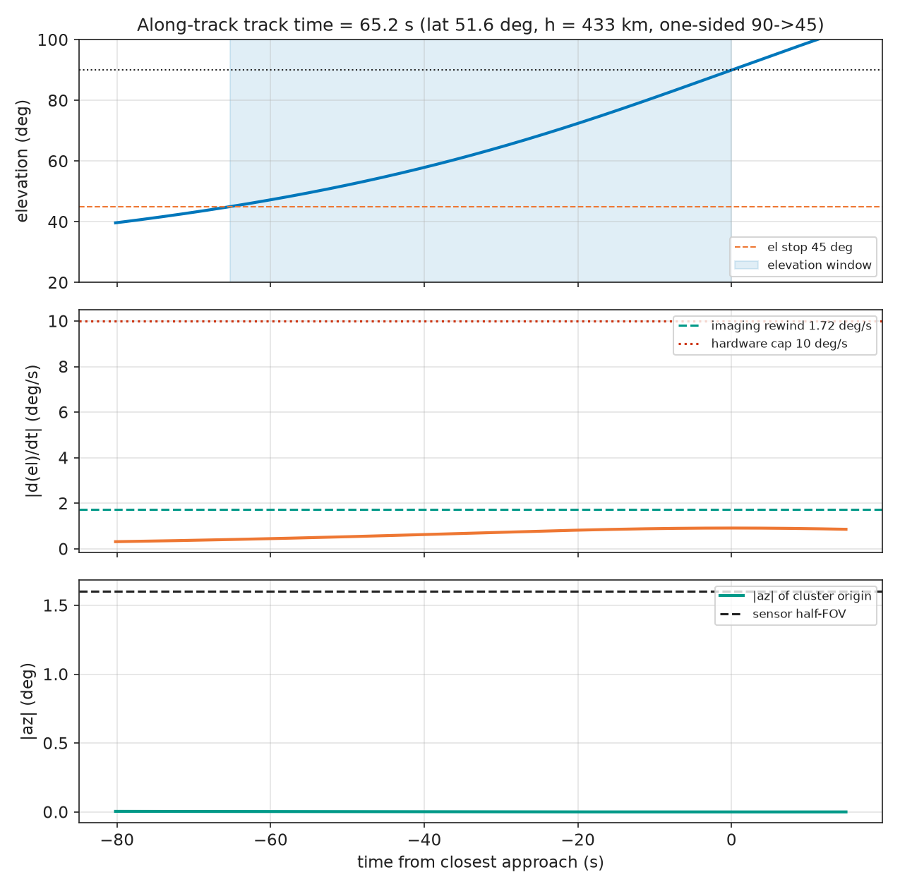
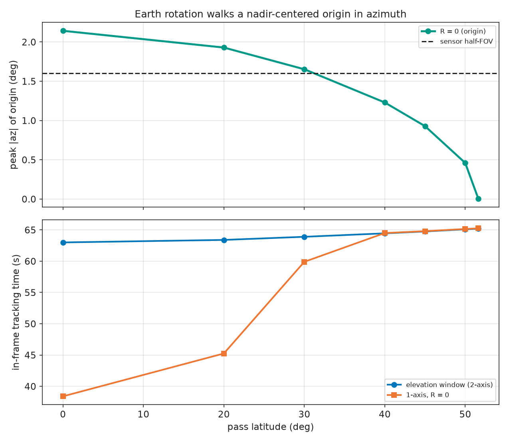
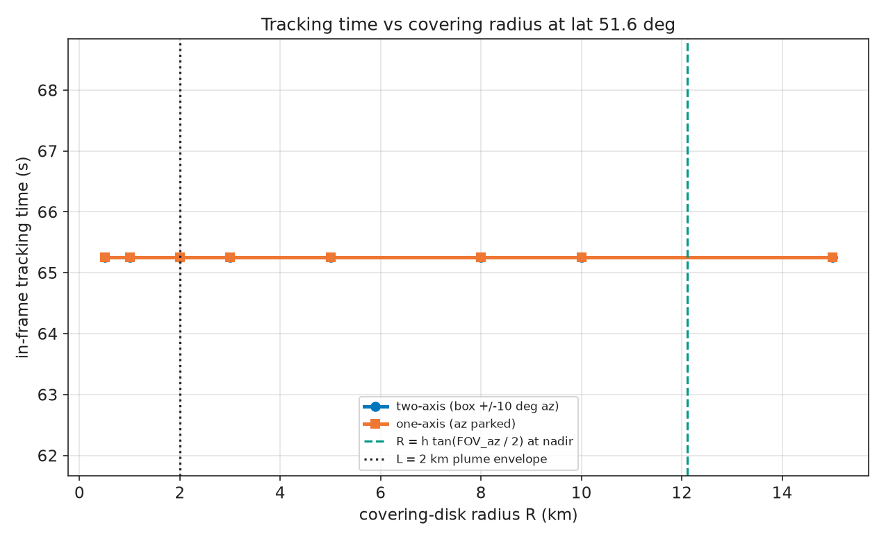
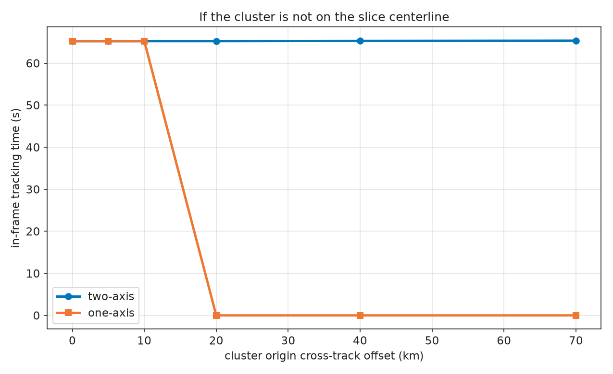
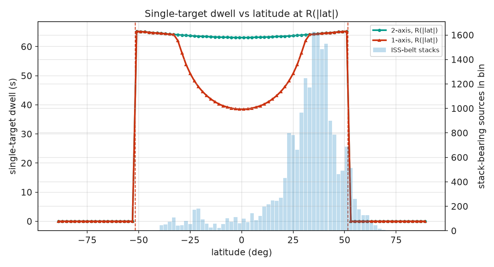
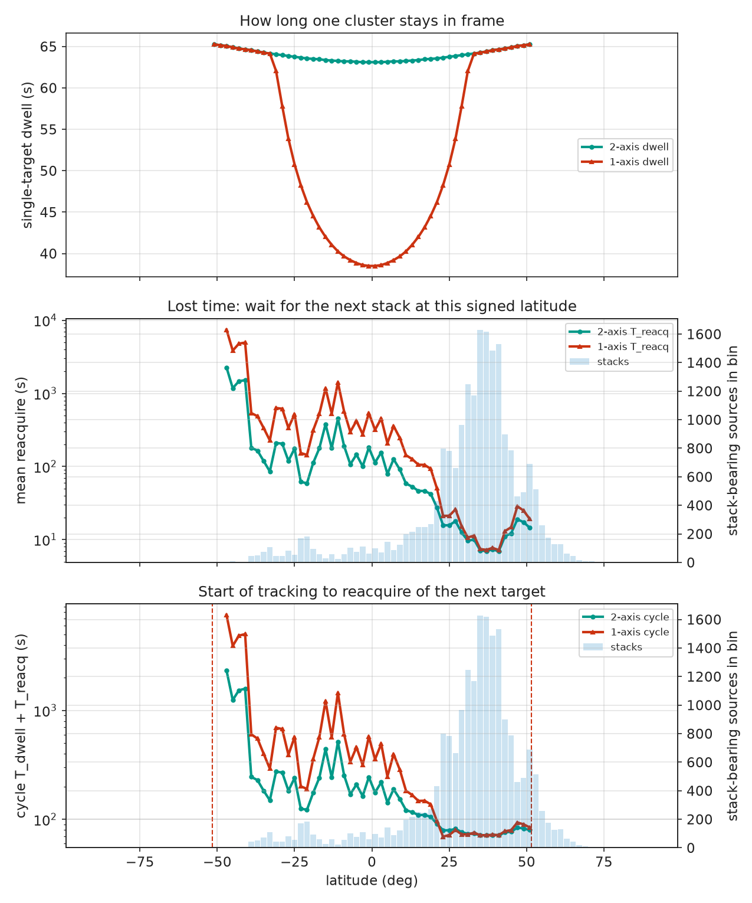
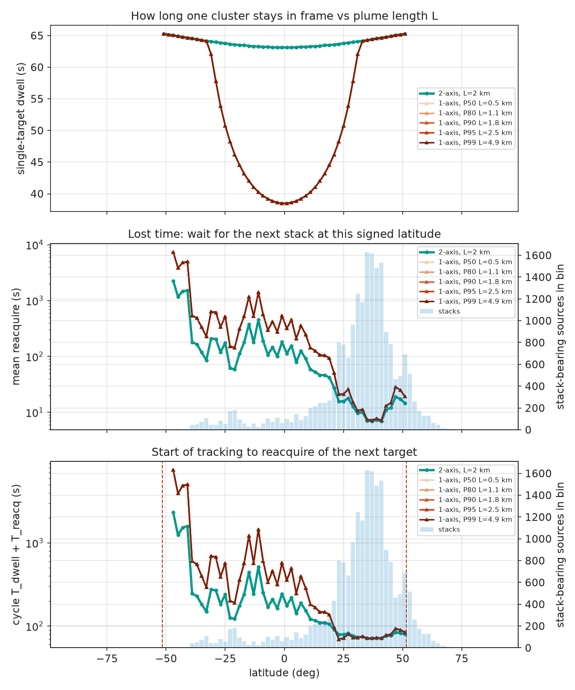

# Single-axis vs dual-axis gimbal

TEMPORARY ANALYSIS. Not flight software. Design study for dropping
the azimuth gimbal axis. Shared geometry lives in `analysis.lib`;
this folder holds generated reports, PNGs, and local inventory downloads.

```text
uv run python -m analysis.studies.single_axis_vs_dual_axis_gimbal geometry
uv run python -m analysis.studies.single_axis_vs_dual_axis_gimbal industry
uv run python -m analysis.studies.single_axis_vs_dual_axis_gimbal all
```

Geometry: [`RESULTS.md`](RESULTS.md). Worldwide stack inventory:
[`INDUSTRIAL.md`](INDUSTRIAL.md) and [`outputs/`](outputs/).

## Physical setup

- **Fixed origin.** Elevation tracks the stack, or the cluster centroid of
  stacks. Wind can swing the visible plume around that point during
  the science window. Tracking plume CoG would add lateral walk this study
  does not model.
- **Covering disk.** Unknown wind azimuth makes a disk of radius **L**
  around each stack. Cluster covering radius is `R = D + L`, with D the
  haversine plant span. That is a possibility set, not a smoke-filled blob.
- **L = 2 km** is a **conservative visible-length envelope**
  (cooling-tower photo climatologies: typical 0.3-0.8 km, winter often
  >0.9 km). A lognormal fit (P50 = 0.50 km, P95 = 2.5 km) to those
  bins, Polak 1984 (short <0.3, medium 0.3-0.9, long >0.9 km), and the
  Indian Point NDCT few-percent tail at 1.6-4 km gives P50/P80/P90/P95/P99
  = 0.50 / 1.1 / 1.8 / 2.5 / 4.9 km. Climate TRACE has plant span D,
  not L. Locked design L sits between P90 and P95. Wind azimuth is
  unknown, so L is a radius: the plume CoG sits somewhere in that disk.
- **Half the disk on chip.** In-frame means at least 50% of covering-disk
  area is on the chip after pointing. One-axis parks at az = 0 (elevation
  tracks the origin). Two-axis boresights the origin when it is inside
  the +/-10 deg keep-out box; if the origin is outside the box that
  sample is out. This replaces the any-part existence test.
- **P(visible)** is that on-chip area fraction. A sample counts if it is
  >= 0.5. Plume volume / Gaussian ribbon (~5% disk fill) is occupancy/SNR
  only. Do not multiply the two.
- **No locked design R.** Operational R is per cluster (`r_cover_km`) and,
  for lat tables, stack-weighted mean `R(|lat|) = D(|lat|) + L`.
- **Camera/lens.** BFS-U3-50S5, Sony IMX264, 3.45 um, 2448x2048,
  2/3-inch, global shutter; 150 mm athermal, 0.66% distortion. Catalog
  2/3-inch HFOV 3.36 deg is a check. 2x2 mosaic => band plane
  1224x1024, IFOV x2. Ignore lens-catalog 2.74 um.
  This is the purchased camera. SIL `ifov=0.02` is a stale placeholder.
- **Science stop.** Elevation window is one-sided
  90->45 deg (eta_max = 45 deg off-nadir).
  That off-nadir max is set from along-track band GSD (~45 m at
  this look on the design pass; ~20 m at nadir; ~118 m at 60 deg).
  Slant range and incidence are reported at the stop, not extra
  caps. Geometric Earth limb is ~69 deg off-nadir and is not a
  detection limit. Window is one-sided (nadir to limb) for this
  run; look-past-nadir is a later check on the plots.
- **Tasking.** Opportunistic detect-in-chip hunt, not catalog cueing.
  Flight SCAN (az raster at el=0) is not the trade baseline.
- **Two slew caps.** Imaging rewind vs ground is the 1-pixel / 1 ms
  **band-plane** gate (current imaging gate). Hardware cap
  **10 deg/s** is not for science frames.
- **Reacquire.** On loss the gimbal immediately slews elevation toward
  45 deg (science limb) at the imaging rewind
  cap. Look-point ground speed is ISS motion plus ds/d(eta)*omega, so
  the FOV ribbon covers new ground faster than orbital motion and can
  acquire during the slew. After the stop, one-axis waits on ISS
  motion through the FOV ribbon; two-axis then rasters azimuth across
  the keep-out box (hypot of az slew and along-track scene rate <=
  imaging gate). Mean wait uses signed-lat stack density (peak near
  30-40 N). Cycle is dwell plus reacquire. Ocean-averaged Poisson
  spacing, not a city-corridor nearest neighbour.
- **Usable visit floor.** Contiguous TRACKING >= 1.0 s
  (~10 full-res cls+seg frames). The ~3 s stare number is no-gimbal
  FOV transit, not an inference floor.

## Headline (design pass, lat 51.63 deg, h = 433 km)

| Quantity | Value |
| --- | --- |
| Camera / lens | BFS-U3-50S5 + 150 mm, Sony IMX264 |
| Usable FOV | 3.20 deg x 2.68 deg |
| Band plane | 1224 x 1024 (IFOV x2) |
| Along-track track time | **65 s** |
| Staring, no gimbal | 3.0 s |
| Peak elevation rate | 0.91 deg/s |
| Imaging rewind (current gate) | **1.72 deg/s** |
| Scene-relative smear limit | 2.64 deg/s |
| Hardware slew cap | 10 deg/s |
| Science stop | 45 deg off-nadir (band GSD along 45 m) |
| Nadir lateral half-swath | +/-12.1 km |
| 2-axis +/-10 deg half-swath | +/-76 km |
| Earth-rotation az walk of the origin | 0.003 deg |

At the design pass the origin stays in the chip. There is no locked
design R. Mid-latitude loss is set by Earth rotation plus R(|lat|)
from the inventory, not by a 5 km placeholder.

## Worldwide stack distribution (Climate TRACE 2025)

| Quantity | Value |
| --- | --- |
| ISS-belt stack fraction | 92.8% |
| Stack-weighted mean R | 4.98 km (inventory, not design) |
| Stacks at |lat| >= 45 deg | **10%** |
| Single-target dwell, stack-weighted | **59 s vs 64 s** |
| Mean reacquire (lost time) | **61 s vs 27 s** |
| Cycle start-of-track to next acquire | **120 s vs 91 s** (duty 71% vs 78%) |
| Daily usable yield (T>=1s x coverage) | **~7x** in favour of 2-axis |

| |lat| (deg) | D (km) | R (km) | singleton % | d_char n>=2 (km) |
| --- | --- | --- | --- | --- |
| 0-10.0 | 1.90 | 3.90 | 50% | 3.72 |
| 10-20.0 | 2.16 | 4.16 | 50% | 4.16 |
| 20-30.0 | 2.87 | 4.87 | 41% | 4.62 |
| 30-40.0 | 3.51 | 5.51 | 35% | 4.85 |
| 40-45.0 | 2.96 | 4.96 | 38% | 4.57 |
| 45-51.6 | 2.31 | 4.31 | 46% | 4.27 |

Most stacks sit at 20-40 N. A polar-slice one-axis view keeps the
65 s window but sees only ~10% of the industry.
Working the mid-latitude belt needs the azimuth axis for Earth-rotation
walk, not just for swath. After a target leaves the frame the gimbal
rewinds toward the limb stop and hunts along that path; two-axis then
rasters azimuth. Lost time is that wait from stack density at signed
latitude (shortest at 30-40 N).

## Figures

PNGs are in git under `outputs/`. CSVs from the same run stay local.















